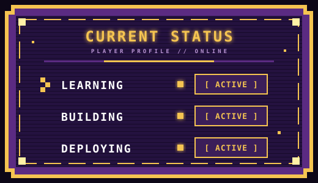
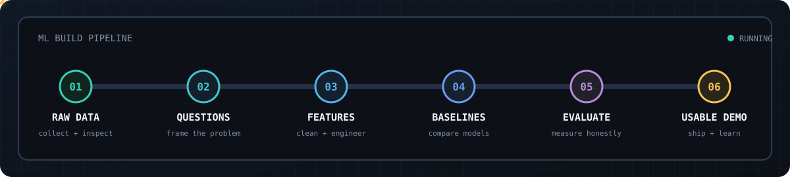
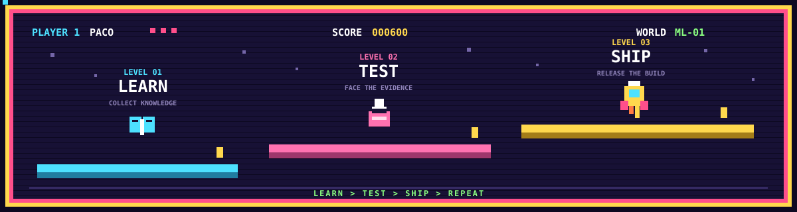

<div align="center">
  
</div>

<div align="center">


<br/>


<br/><br/>

<a href="https://rakibhasandc27.blogspot.com/"></a>
&nbsp;

&nbsp;
<a href="https://github.com/serakib?tab=followers"></a>

</div>

<br/>

<!--   my-header-img -->

<a href="https://www.python.org/"></a>


<!--   my-ticker -->    
[](https://git.io/typing-svg)

---

```yaml
  name     :  Md.Rakib Hasan
  username :  serakib
  role     :  Aspiring Software Engineer
  college  :  Dhaka College  |  HSC 2027  |  Science
  location :  Dhaka, Bangladesh
  goal     :  "Try something new"
```

---

<table>
<tr>
<td width="55%" valign="top">

<div align="center">

  <h2>
    
## About Me  
  
</h2>
  
I am a student at Dhaka College studying Science, passionate about building things on the web.
Currently focused on frontend development, expanding into backend and automation.
Every project is a new lesson.

[MIT](LICENSE)

</td>
<td width="45%" valign="top">

<div align="center">

<p></p>

</div>

</td>
</tr>
</table>

---
<!-- Snake Game Repo View -->

## 🐍 CONTRIBUTION SNAKE

 

<picture>
  <source
    media="(prefers-color-scheme: dark)"
    srcset="https://raw.githubusercontent.com/serakib/serakib/output/github-snake-dark.svg"
  />
  <source
    media="(prefers-color-scheme: light)"
    srcset="https://raw.githubusercontent.com/serakib/serakib/output/github-snake.svg"
  />
  
</picture>

<br>


[](https://github.com/serakib)

---


---

<table>
<tr>
<td width="55%" valign="top">

<div align="center">

  <h2>

### Profile Views

 
    </h2>
    
counting of visitors to this page in this section started from October 5, 2026

Reload the Page & Observe What's Happen then  !  

Don't Take it Negatively  !  Just for Count Purpose.


<div align="center">


</br>
</div>

</td>
<td width="45%" valign="top">

<div align="center">



</div>

</td>
</tr>
</table>


---

## 🏆 GitHub Trophies

 
    

<p align="center">
  
</p>

## Skills

 
    

<div align="center">


<br/><br/>

| Skill | Proficiency |
|:---|:---|
| HTML5 | `████████████████████` 80% |
| CSS3 | `█████████████████░░░` 65% |
| JavaScript | `██████████████░░░░░░` 40% |
| C Programming | `█████████░░░░░░░░░░░` 30% |
---

## Projects

 

<div align="center">

<table>
  <tr>
    <td align="center" width="240">
      <strong>Fallrush</strong><br/>
      <sub>A creative game for fun</sub><br/><br/>
      <a href="https://serakib.github.io/Fallrush/">
        
      </a>
    </td>
    <td align="center" width="240">
      <strong>GreenLine vPC</strong><br/>
      <sub>A escape model game for entertainment</sub><br/><br/>
      <a href="https://serakib.github.io/GreenLine/">
        
      </a>
    </td>
  </tr>
  <tr>
    <td align="center" width="240">
      <strong>Personal Blog</strong><br/>
      <sub>Articles, notes and dev writeups</sub><br/><br/>
      <a href="https://medium.com/@rakibhasan27">
        
      </a>
    </td>
    <td align="center" width="240">
      <strong>OverTake cPC</strong><br/>
      <sub>A smooth car Game that reminds childhood.</sub><br/><br/>
      <a href="https://serakib.github.io/OverTake/">
        
      </a>
    </td>
  </tr>
</table>

</div>

---
## 📊 GitHub Stats

 

<div align="center">


<br>


</div>

---

## My Build Pattern

 

<div align="center">



</div>

I compare meaningful models, document trade-offs, preserve reproducible workflows, and keep the limitations visible.


---

## GitHub Overview

 


<div align="center">
  
  
</div>

<table>
<tr>
<td width="33%">


</td>
<td width="33%">


</td>
<td width="33%">


</td>
</tr>
</table>
</p>

</div>

  <div align="center">
    
  </div>

<div align="center">
  
</div>

<div align="center">

---


## Activity Graph

 

<div align="center">


</div>

---


## Connect

 

<div align="center">

<br />



</div>


<div align="center">

<a href="https://rakibhasandc27.blogspot.com/"></a>
&nbsp;
<a href="https://www.facebook.com/profile.php?id=61579557960701"></a>
&nbsp;
<a href="https://telegram.com/@rakibhasan27"></a>
&nbsp;
<a href="https://wa.me/8801518935652"></a>
&nbsp;
<a href="mailto:rakibhasandc27@gmail.com"></a>

</div>

<br/>

---

<div align="center">


<sub>Copyright (c) 2026 &nbsp;&bull;&nbsp; Md.Rakib Hasan &nbsp;&bull;&nbsp; Dhaka, Bangladesh &nbsp;&bull;&nbsp; 2026</sub>

</div>
